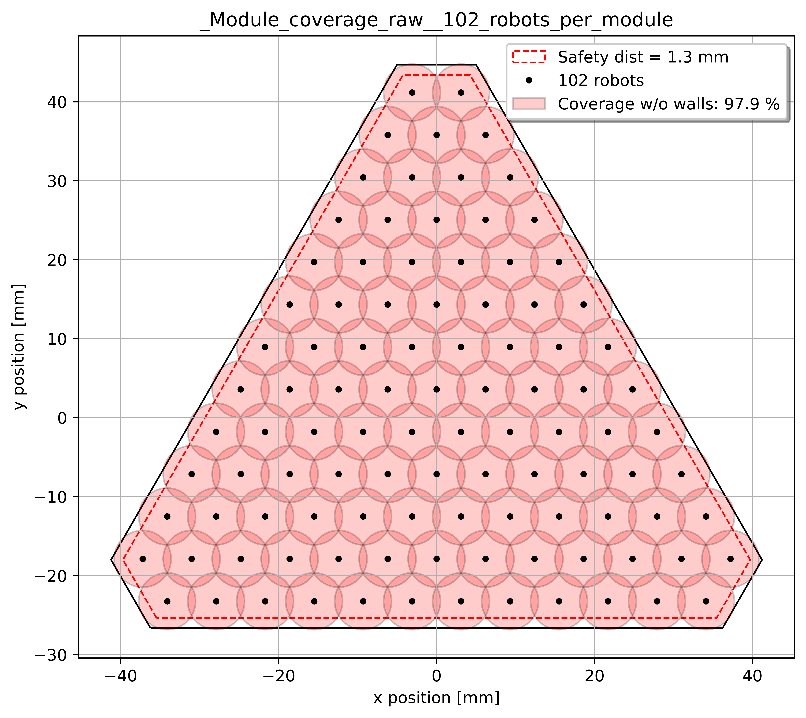
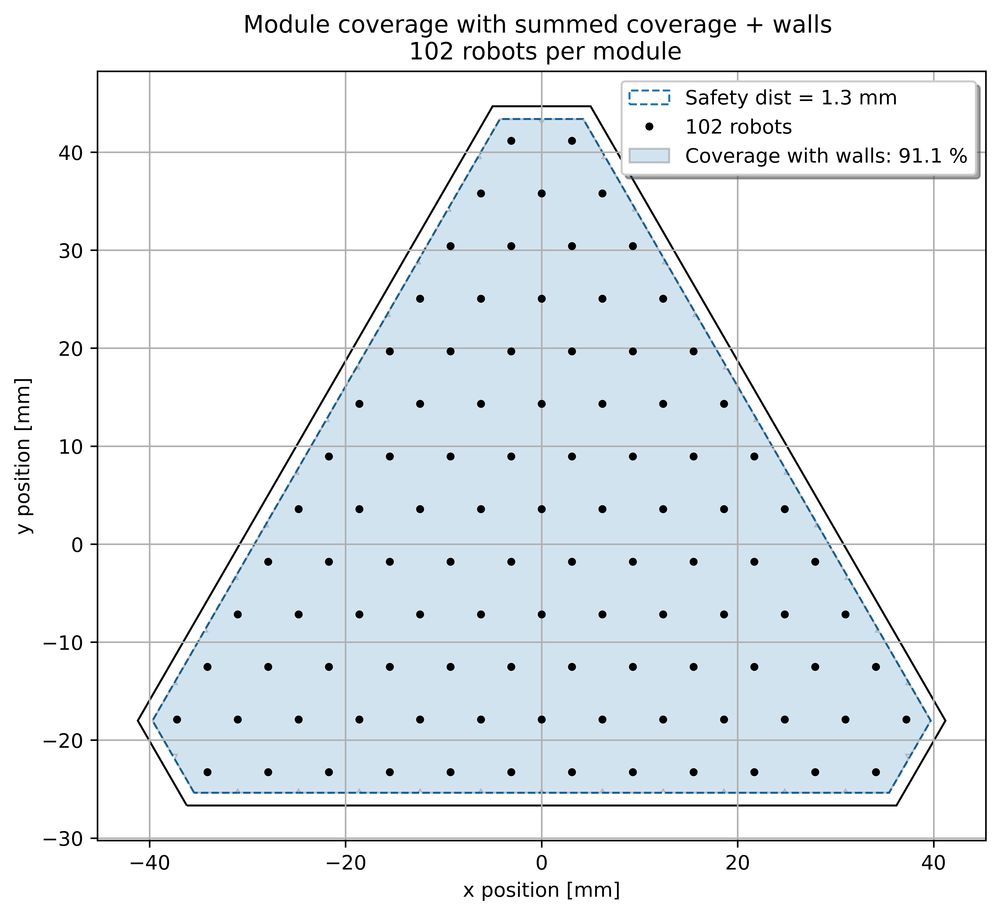

# Focal Plane Calculations

The current repo aims to be a design tool for multiplex modular telescopes.
It produces 2 main information:

1. Coverage: fraction of the vignetting area covered by the summed up workspaces of all the robots
2. Positions: 3D positions (x,y,z, $\theta$, $\phi$) of robots & modules within the focal plane

# Results examples

Typical resulting files can be found in *Results_examples* folder:

## Individual robots workspaces

The first output shows the smallest build brick of this program. It shows the shape of a module of positioners, along with each individual workspace.

## Summed robots workspaces

As we are interested in the net coverage of each module, the previous workspaces are summed up to calculate the net area covered by the positioners with a module.

